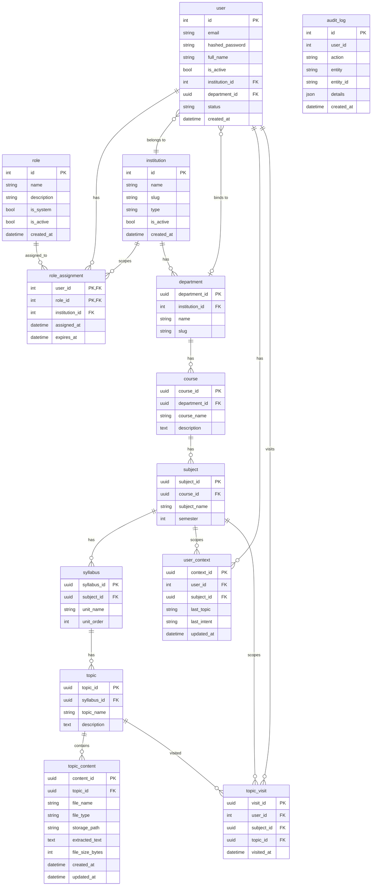

# Database Schema (summary)

This file summarizes the tables and key fields in `app/models`.

## ER Diagram

## Tables (backend)

- `user` (PK: `id` int)
  - `email`, `hashed_password`, `full_name`, `is_active`, `institution_id` (FK -> institution.id), `department_id` (FK -> department.department_id), `status`, `created_at`

- `role` (PK: `id` int)
  - `name`, `description`, `is_system`, `is_active`, `created_at`

- `role_assignment` (composite PK: `user_id`, `role_id`)
  - `institution_id` (FK -> institution.id, optional scope), `assigned_at`, `expires_at`

- `institution` (PK: `id` int)
  - `name`, `slug`, `type`, `is_active`, `created_at`

- `department` (PK: `department_id` uuid)
  - `institution_id` (FK -> institution.id), `name`, `slug`

- `course` (PK: `course_id` uuid)
  - `department_id` (FK -> department.department_id), `course_name`, `description`

- `subject` (PK: `subject_id` uuid)
  - `course_id` (FK -> course.course_id), `subject_name`, `semester`

- `syllabus` (PK: `syllabus_id` uuid)
  - `subject_id` (FK -> subject.subject_id), `unit_name`, `unit_order`

- `topic` (PK: `topic_id` uuid)
  - `syllabus_id` (FK -> syllabus.syllabus_id), `topic_name`, `description`

- `topic_content` (PK: `content_id` uuid)
  - `topic_id` (FK -> topic.topic_id), `file_name`, `file_type`, `storage_path`, `extracted_text`, `file_size_bytes`, `created_at`, `updated_at`

- `user_context` (PK: `context_id` uuid)
  - `user_id` (FK -> user.id), `subject_id` (FK -> subject.subject_id), `last_topic`, `last_intent`, `updated_at`

- `topic_visit` (PK: `visit_id` uuid)
  - `user_id` (FK -> user.id), `subject_id` (FK -> subject.subject_id), `topic_id` (FK -> topic.topic_id), `visited_at`

- `audit_log` (PK: `id` int)
  - `user_id`, `action`, `entity`, `entity_id`, `details` (JSON), `created_at`

## Notes

- Content tables use UUID primary keys for portability/cross-tenant decoupling.
- User/tenant tables use integer PKs suitable for RBAC and indexing.
- `audit_log.user_id` is not a formal FK (soft reference) to support logging for deleted users.
- For existing databases, run migrations to add `department`, `topic_content`, `topic_visit`, `audit_log`, and new columns (`user.department_id`, `course.department_id`).
